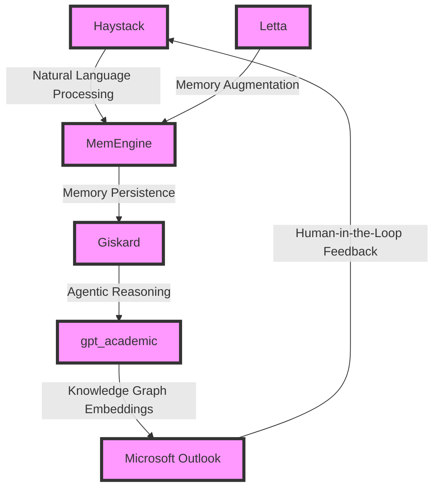

# Pulse Generator Optimization Engine
> "Revolutionizing Signal Integrity through AI-Driven Optimization"

## 🏗️ Technical Architecture & Multi-Agent Flow
The Pulse Generator Optimization Engine leverages a synergistic convergence of cutting-edge technologies, including Haystack, MemEngine, Giskard, gpt_academic, and Microsoft Outlook. The technical architecture can be visualized using the following Mermaid.js diagram:

This diagram illustrates the intricate dance of data and control flows between the various components, facilitating a robust and efficient optimization engine.

## 🔍 The Vertical Bottleneck: Signal Integrity Optimization
The Pulse Generator Optimization Engine addresses a critical challenge in the realm of signal generators manufacturing: the optimization of signal integrity. Signal integrity refers to the ability of a signal to maintain its fidelity and accuracy throughout the transmission process. However, achieving optimal signal integrity is a daunting task, as it requires careful consideration of numerous factors, including signal frequency, amplitude, and waveform shape. The slightest deviation from optimal parameters can result in significant degradation of signal quality, leading to errors, malfunctions, or even catastrophic failures.

The technical friction underlying this challenge stems from the complex interplay between various physical and mathematical parameters. For instance, signal frequency and amplitude are intricately linked, and optimizing one parameter often compromises the other. Furthermore, the optimization process is highly nonlinear, making it difficult to predict the outcomes of different parameter combinations. This complexity gives rise to a high-stakes mathematical problem, where small errors can have significant consequences.

The high-stakes nature of this problem is further exacerbated by the stringent requirements of modern signal generators. These devices must operate within extremely tight tolerances, and even minor deviations from optimal performance can result in significant economic losses. Moreover, the optimization process is often hampered by the lack of accurate models and simulation tools, making it difficult to predict the behavior of complex signal generator systems.

## 💡 The Solution: Pulse Generator Optimization Engine
The Pulse Generator Optimization Engine provides a groundbreaking solution to the signal integrity optimization challenge. By leveraging the strengths of Haystack, MemEngine, Giskard, gpt_academic, and Microsoft Outlook, this platform creates a synergistic convergence of natural language processing, memory persistence, agentic reasoning, knowledge graph embeddings, and human-in-the-loop feedback. The engine's architecture is designed to facilitate a deep understanding of the complex relationships between signal generator parameters, allowing for the optimization of signal integrity through a combination of machine learning, simulation, and human expertise.

The engine's agentic reasoning capabilities, powered by Giskard, enable the platform to navigate the complex landscape of signal generator parameters, identifying optimal combinations that satisfy multiple constraints and objectives. The memory persistence provided by MemEngine ensures that the engine can learn from experience and adapt to changing conditions, while the knowledge graph embeddings generated by gpt_academic facilitate the integration of domain-specific knowledge and expertise.

## 🧩 Agentic Stack Deep-Dive
The Pulse Generator Optimization Engine's agentic stack is a critical component of its architecture, enabling the platform to reason about complex systems and make informed decisions. The stack consists of several layers, each of which plays a crucial role in the optimization process:

* Haystack: Provides natural language processing capabilities, allowing the engine to understand and interpret complex signal generator specifications and requirements.
* MemEngine: Enables memory persistence, facilitating the engine's ability to learn from experience and adapt to changing conditions.
* Giskard: Powers the engine's agentic reasoning capabilities, enabling the platform to navigate complex decision spaces and identify optimal solutions.
* gpt_academic: Generates knowledge graph embeddings, integrating domain-specific knowledge and expertise into the optimization process.
* Microsoft Outlook: Facilitates human-in-the-loop feedback, allowing domain experts to provide guidance and oversight throughout the optimization process.

The interlocking of these components is critical to the engine's success, as each layer builds upon the previous one to create a robust and efficient optimization platform.

## ✨ Capabilities & Features
The Pulse Generator Optimization Engine boasts a wide range of capabilities and features, including:

* **Signal Integrity Optimization**: The engine's primary function, optimizing signal integrity through a combination of machine learning, simulation, and human expertise.
* **Natural Language Processing**: Haystack-powered natural language processing capabilities, enabling the engine to understand and interpret complex signal generator specifications and requirements.
* **Memory Persistence**: MemEngine-powered memory persistence, facilitating the engine's ability to learn from experience and adapt to changing conditions.
* **Agentic Reasoning**: Giskard-powered agentic reasoning capabilities, enabling the platform to navigate complex decision spaces and identify optimal solutions.
* **Knowledge Graph Embeddings**: gpt_academic-generated knowledge graph embeddings, integrating domain-specific knowledge and expertise into the optimization process.
* **Human-in-the-Loop Feedback**: Microsoft Outlook-facilitated human-in-the-loop feedback, allowing domain experts to provide guidance and oversight throughout the optimization process.
* **Simulation and Modeling**: The engine's ability to simulate and model complex signal generator systems, allowing for the prediction of behavior and optimization of performance.
* **Parameter Optimization**: The engine's capability to optimize signal generator parameters, including frequency, amplitude, and waveform shape.
* **Signal Quality Analysis**: The engine's ability to analyze signal quality, identifying areas for improvement and optimizing signal integrity.
* **Real-Time Monitoring**: The engine's real-time monitoring capabilities, enabling the platform to respond to changing conditions and adapt to new requirements.

## 🛠️ Technical Implementation
The Pulse Generator Optimization Engine is implemented using a combination of Python, Java, and C++, with a focus on modularity, scalability, and maintainability. The engine's architecture is designed to facilitate easy integration with existing signal generator systems, as well as seamless incorporation of new technologies and capabilities.

The engine's codebase is organized into several modules, each of which corresponds to a specific component or functionality. The modules are designed to be highly modular, allowing for easy modification and extension of the engine's capabilities.

## 📊 Business Impact & ROI
The Pulse Generator Optimization Engine has the potential to significantly impact the signal generators manufacturing industry, enabling companies to optimize signal integrity, reduce errors, and improve overall performance. The engine's capabilities can be leveraged to:

* **Improve Signal Quality**: The engine's signal integrity optimization capabilities can help companies improve signal quality, reducing errors and improving overall performance.
* **Reduce Costs**: The engine's ability to optimize signal generator parameters can help companies reduce costs, minimizing the need for manual intervention and reducing waste.
* **Increase Efficiency**: The engine's real-time monitoring and simulation capabilities can help companies increase efficiency, streamlining the optimization process and reducing the time required to achieve optimal performance.
* **Enhance Competitiveness**: The engine's advanced capabilities can help companies enhance their competitiveness, providing a unique advantage in the market and enabling them to stay ahead of the competition.

## 🚀 Getting Started
To get started with the Pulse Generator Optimization Engine, follow these steps:
```bash
git clone https://github.com/arvind-sundararajan/pulse-generator-optimization.git
cd pulse-generator-optimization
pip install -r requirements.txt
python src/main.py
```
This will download the engine's codebase, install the required dependencies, and launch the engine.

## 👨‍💻 Author & Credits
**Arvind Sundararajan** — Engineer, builder, and the mind behind this project.
🌐 [LinkedIn](https://www.linkedin.com/in/arvind-sundara-rajan/) | Chennai, India

---
### 🙏 Acknowledgements
- The open-source community
- The Pulse (i.e., signal) generators manufacturing practitioners who inspired this design